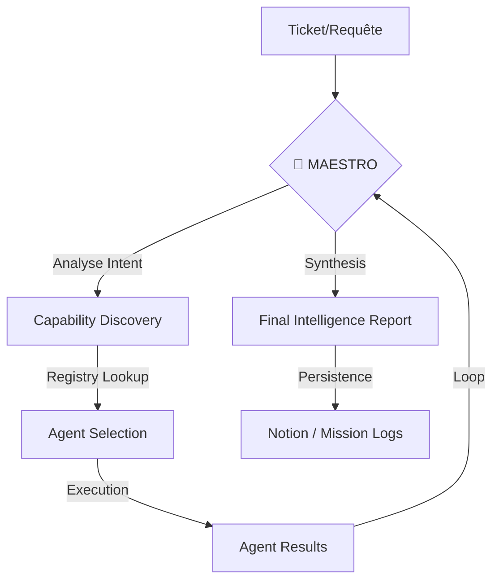

# 🌀 MASTER AGENT INSTRUCTIONS — TWISTERLAB (v4.0.0)

> **Source**: Consolidé et modernisé depuis `.agent/AGENT_INSTRUCTIONS.md`
> **Dernière mise à jour**: 2026-06-03 (Cleanup Trading & Social)
> **Statut**: Operationnel - Focus IT Automation & MCP Platform

---

## 🎯 VISION DU PROJET

**TwisterLab** est une plateforme IA multi-agents autonome conçue pour l'automatisation IT avancée :
1.  **Support Technique Autonome** : Analyse, diagnostic et résolution d'incidents d'infrastructure sans intervention humaine.
2.  **Plateforme MCP (Model Context Protocol)** : Exposition de capacités système, browser automation, et outils d'administration via une interface IA unifiée.

### Flux de Traitement Maestro v4.0+


---

## 🏗️ ARCHITECTURE TECHNIQUE CRITIQUE

### Stack Core
| Composant | Technologie | Note Critique |
| :--- | :--- | :--- |
| **Backend** | Python 3.11+ / FastAPI | Async-first for all I/O |
| **Database** | PostgreSQL + `asyncpg` | **INTERDICTON** d'utiliser `create_engine` (sync) |
| **Orchestrateur** | `RealMaestroAgent` | Capability-driven planning (JSON output) |
| **Discovery** | `AgentRegistry` | Lazy-loading + Thread-safe Singleton |
| **Infrastructure** | Kubernetes (K3s) | Cluster sur **192.168.0.30** (EDGESERVER-OPS) |
| **LLM Interface** | Cortex IA / MCP | Abstraction via `CortexIAAgent` |

### Agents du Registry
Situés dans `src/twisterlab/agents/real/` :

| Catégorie | Agents Clés | Rôle Principal |
| :--- | :--- | :--- |
| **Core** | `Maestro`, `Cortex`, `Archive` | Pilotage, IA Maîtresse, Stockage Missions |
| **Analyse** | `Classifier`, `Sentiment`, `Summarizer`, `Translation` | Traitement NLP et Compréhension intent |
| **Action** | `Commander`, `Browser`, `Resolver`, `Backup` | Exécution système, Web, Résolution, Sécurité |
| **Intelligence** | `Notion`, `N8n-Navigator` | Workspace Sync, Automations IT |
| **Expertise** | `Code-Review`, `Vba-Expert`, `Sync`, `Database` | Analyse tech, Excel Automation, Cohérence DB |

---

## 📁 STRUCTURE DU WORKSPACE

```text
twisterlab/
├── src/twisterlab/              # ⚡ CODE SOURCE (Production Only)
│   ├── agents/
│   │   ├── real/                # Implémentations des agents
│   │   ├── core/                # Classes de base (CoreAgent, TwisterAgent)
│   │   ├── base/                # Adapteurs et abstractions
│   │   └── registry.py          # Cerveau de découverte des agents
│   ├── api/
│   │   ├── main.py              # FastAPI Entrypoint
│   │   └── routes_mcp_real.py   # 40+ Endpoints MCP exposés
│   └── database/                # Sessions async & Models
├── k8s/                         # Manifests Kubernetes (Deployments, HPA, Monitoring)
├── tests/                       # Pytest (unit, integration, e2e)
├── scripts/                     # DevOps (Scaffolding, Health checks)
└── .agent/AGENT_INSTRUCTIONS.md # ← CE FICHIER (Source of Truth)
```

---

## ⚠️ RÈGLES DE DÉVELOPPEMENT (LOIS D'ASIMOV TWISTERLAB)

### 1. Interdiction du Sync I/O
Tout accès DB ou Réseau **DOIT** être `async`.
```python
# ✅ CORRECT
async with AsyncSessionLocal() as session: ...
# ❌ ERREUR
session = SessionLocal() # Crash la boucle Event Loop
```

### 2. Pydantic v2 Uniquement
Utiliser `model_dump()` au lieu de `dict()`.

### 3. Capability discovery
Ne jamais coder en dur ("Hardcode") un nom d'agent dans Maestro. Utiliser `agent_registry.find_agent_by_capability("browse")`.

### 4. Zero Secrets
Interdiction de committer `.env` ou clés privées. Utiliser `k8s/base/secrets.yaml` (avec placeholders).

---

## 🚀 COMMANDES DE SURVIE

### Dev & Test
```powershell
# Lancer l'environnement
$env:PYTHONPATH="src"; uvicorn twisterlab.api.main:app --reload

# Vérifier la santé des agents
python src/twisterlab/agents/registry_check.py # Si existant

# Tests (Qualité non-négociable)
pytest tests/unit -v
pytest tests/integration -v
```

### Infrastructure (192.168.0.30)
```bash
# Debugging Cluster
kubectl get pods -n twisterlab
kubectl logs -f deployment/twisterlab-api -n twisterlab
```

---

## 🔴 PRIORITÉS ACTUELLES (Mission Roadmap)

1.  **Dashboard Stabilité** : Correction des `CrashLoopBackOff` sur les pods API (vérifier logs `asyncpg`).
2.  **Observabilité MCP** : Amélioration du traçage des appels d'outils via Maestro.
3.  **Browser Automation Resilience** : Gérer les timeouts et les changements de DOM dans l'agent Browser.
4.  **Maestro Synthesis Repair** : Optimiser la gestion des erreurs JSON lors de la synthèse des résultats par le LLM.

---

**🌀 "Antigravity" Agent Mode**: En tant qu'assistant de codage, tu dois toujours vérifier la compatibilité `async` et l'enregistrement dans le `registry` pour toute nouvelle fonctionnalité.
