<div align="center">

# 🌀 TwisterLab v3.5.0

[](https://github.com/youneselfakir0/twisterlab/actions/workflows/ci.yml)
[](https://github.com/youneselfakir0/twisterlab/actions/workflows/cd.yml)
[](https://codecov.io/gh/youneselfakir0/twisterlab)
[](LICENSE)
[](pyproject.toml)
[](deploy/k8s/)
[](#-testing)

### **Universal MCP Platform for Autonomous AI Agents**

TwisterLab acts as a bridge between LLMs (**Claude**, **Ollama**) and your infrastructure. It exposes specialized Agents (Browser, Monitoring, Code Review) via the standardized **Model Context Protocol (MCP)**.

[🚀 Quick Start](#-quick-start) • [📚 Documentation](docs/) • [🤝 Contributing](#-contributing) • [📊 Demo](#-demo)

</div>

---

## 🆕 What's New in v3.5.0

### ✅ **REAL Agent Implementations** (Production-Ready)

| Agent | Before | After |
|-------|--------|-------|
| **MonitoringAgent** | ❌ Hardcoded `{cpu: 45}` | ✅ Real psutil metrics |
| **DesktopCommander** | ❌ Simulated `return "OK"` | ✅ Real subprocess + security |
| **Maestro** | ❌ Empty orchestration | ✅ Full LLM-powered workflow |

### 🔒 **Security Features**
- **51+ whitelisted safe commands** (hostname, df, ps, etc.)
- **Dangerous command blocking** (rm -rf, format, etc.)
- **Timeout protection** (max 300s)
- **Audit logging** of all command executions

### 📊 **Monitoring Stack**
- **Grafana Dashboard** with real-time gauges (CPU, RAM, Disk)
- **Prometheus Alert Rules** (25+ rules)
- **Alertmanager** with Slack/Email routing

### 🚀 **Kubernetes HA**
- **HorizontalPodAutoscaler** (3-10 replicas)
- **PodDisruptionBudget** (min 2 available)
- **NetworkPolicy** for security isolation

---

## 🏗️ Architecture

TwisterLab is built as a **Hybrid AI Operating System** with autonomous multi-agent orchestration:

```mermaid
graph TB
    subgraph "Input"
        TICKET[📝 Support Ticket]
    end
    
    subgraph "TwisterLab Platform"
        API[🌐 FastAPI Server]
        MAESTRO[🧠 Maestro Orchestrator]
        
        subgraph "Agents"
            SENT[😊 Sentiment]
            CLASS[🏷️ Classifier]
            CMD[💻 Commander]
            MON[📊 Monitoring]
            RES[✅ Resolver]
        end
    end
    
    TICKET --> API --> MAESTRO
    MAESTRO --> SENT & CLASS & CMD & MON & RES
```



- **Core API**: FastAPI + Python 3.11 (Async)
- **Transport**: Native MCP (Stdio & SSE)
- **Orchestrator**: **Maestro Agent** - LLM-powered decision making
- **Agents** (9 total):
  - 🧠 **Maestro**: Orchestrates multi-agent workflows
  - 😊 **Sentiment Analyzer**: Detects urgency and emotion
  - 🏷️ **Classifier**: Categorizes tickets
  - 💻 **Desktop Commander**: Executes system commands
  - 🌍 **Browser Agent**: Web automation (Playwright)
  - 📈 **Monitoring Agent**: System health & K8s metrics
  - ✅ **Resolver**: Ticket resolution
  - 💾 **Backup**: Data backup
  - 🔄 **Sync**: Data synchronization
- **Infrastructure**:
  - **Kubernetes**: Scalable deployment
  - **Docker**: Containerized runtime
  - **Ollama**: Local LLM inference

---

## ✨ Key Features

1. **🧠 Autonomous Orchestration**: Maestro agent coordinates multi-agent workflows with LLM intelligence.
2. **🔌 Seamless Integration**: Connects natively to **Claude Desktop**, **Continue IDE**, and **LM Studio**.
3. **🕸️ Real Web Browsing**: TwisterLab drives a real browser via Playwright.
4. **🛡️ Security First**: Rate limiting, Network Policies, and secret scanning.
5. **⚡ High Performance**: Redis caching and async Pydantic validation.

### 🚀 Maestro API

```bash
# Analyze a task
curl -X POST http://localhost:8000/api/v1/mcp/tools/analyze_task \
  -H "Content-Type: application/json" \
  -d '{"task": "Database is slow"}'

# Full orchestration (dry run)
curl -X POST http://localhost:8000/api/v1/mcp/tools/orchestrate \
  -H "Content-Type: application/json" \
  -d '{"task": "Server returning 502 errors", "dry_run": true}'
```

---

## 🚀 Quick Start

### 1. Requirements
- **Docker** & **Kubernetes** (k3d, minikube, or bare metal).
- **Python 3.11+** (for local dev).

### 2. Configure Claude Desktop ("Pro Mode")

To give Claude access to your Kubernetes cluster agents:

**File**: `%APPDATA%\Claude\claude_desktop_config.json`

```json
{
  "mcpServers": {
    "TwisterLab": {
      "command": "kubectl",
      "args": [
        "exec",
        "-i",
        "-n",
        "twisterlab",
        "deployment/twisterlab-api",
        "--",
        "python",
        "-m",
        "twisterlab.agents.mcp.server"
      ]
    }
  }
}
```

### 3. Local Development (Optional)

If you don't use Kubernetes, you can run the server locally:

```bash
# Install dependencies including Playwright
pip install poetry
poetry install
poetry run playwright install chromium

# Run server with SSE support
export PYTHONPATH=src
python -m uvicorn twisterlab.api.main:app --port 8000 --reload
```

---

## 📦 Project Structure

```
twisterlab/
├── 📁 src/twisterlab/          # Application Core
│   ├── 📁 agents/              # Autonomous Agents (Real Implementations)
│   │   ├── 📁 real/            # Browser, CodeReview, Monitoring
│   │   └── 📁 mcp/             # MCP Server Logic (Stdio/SSE)
│   ├── 📁 api/                 # FastAPI Routes & Main entrypoint
│   └── 📁 db/                  # Database Models (SQLAlchemy)
│
├── 📁 deploy/                  # Deployment Configurations
│   ├── 📁 docker/              # Dockerfiles (API, Agents)
│   └── 📁 k8s/                 # Kubernetes Manifests
│
├── 📁 monitoring/              # Observability (Grafana/Prometheus)
├── 📁 tests/                   # Pytest & Performance Benchmarks
└── 📄 pyproject.toml           # Dependencies
```

---

## 🧪 Testing

```bash
# Run Unit Tests
pytest

# Run End-to-End Tests (requires environment)
export E2E=1
pytest -m e2e
```

---

## 🤝 Contributing

Contributions are welcome! Please read [CONTRIBUTING.md](CONTRIBUTING.md).

1. Fork the repo.
2. Create your feature branch (`git checkout -b feature/amazing-feature`).
3. Commit your changes.
4. Push to the branch.
5. Open a Pull Request.

---

<div align="center">
Built with ❤️ by Younes El Fakir for the AI Community.
</div>
