# 🧠 RealMaestroAgent - Orchestrator Brain

> The central intelligence that coordinates all TwisterLab agents

## Overview

The `RealMaestroAgent` is the **orchestrator brain** of TwisterLab. It:

1. **Analyzes** incoming tasks using LLM or rule-based logic
2. **Plans** multi-step resolution workflows
3. **Dispatches** specialized agents in sequence
4. **Synthesizes** results into actionable outcomes

## Architecture

```mermaid
flowchart TB
    subgraph "Input"
        TASK[📝 Task/Ticket]
    end
    
    subgraph "RealMaestroAgent"
        ANALYZE[🔍 analyze_task]
        PLAN[📋 create_plan]
        EXEC[🚀 execute_plan]
        SYNTH[📊 synthesize]
        
        subgraph "Analysis Strategies"
            LLM[🤖 LLM Analysis<br/>Ollama/Claude]
            RULES[📏 Rule-Based<br/>Keyword Matching]
        end
    end
    
    subgraph "Agents"
        A1[😊 Sentiment]
        A2[🏷️ Classifier]
        A3[💻 Commander]
        A4[✅ Resolver]
    end
    
    subgraph "Output"
        RESULT[📊 OrchestrationResult]
    end
    
    TASK --> ANALYZE
    ANALYZE --> LLM
    LLM -.->|fallback| RULES
    RULES --> PLAN
    LLM --> PLAN
    PLAN --> EXEC
    EXEC --> A1
    EXEC --> A2
    EXEC --> A3
    EXEC --> A4
    A1 --> SYNTH
    A2 --> SYNTH
    A3 --> SYNTH
    A4 --> SYNTH
    SYNTH --> RESULT
```



## Capabilities

### 1. `orchestrate`

Full orchestration workflow with optional dry-run mode.

**Parameters:**
| Param | Type | Required | Description |
| ----- | ---- | -------- | ----------- |
| `task` | string | ✅ | Task description to process |
| `context` | dict | ❌ | Additional context (priority, metadata) |
| `dry_run` | bool | ❌ | If true, plan only without execution |

**Response:**
```json
{
  "success": true,
  "data": {
    "task_id": "task_20260106_143022",
    "analysis": {
      "category": "database",
      "priority": "critical"
    },
    "plan": {
      "agents": ["sentiment-analyzer", "classifier", "resolver"],
      "steps": [...]
    },
    "execution_results": [...],
    "synthesis": {
      "summary": "Processed task with 4/4 successful steps",
      "success_rate": 1.0,
      "requires_human": false
    }
  }
}
```

### 2. `analyze_task`

Analyze a task to determine category, priority, and suggested agents.

**Parameters:**
| Param | Type | Required | Description |
| ----- | ---- | -------- | ----------- |
| `task` | string | ✅ | Task description to analyze |

**Response:**
```json
{
  "success": true,
  "data": {
    "category": "database",
    "priority": "high",
    "suggested_agents": ["real-desktop-commander", "monitoring"],
    "keywords": ["database", "slow", "query"]
  }
}
```

## Analysis Strategies

### LLM Analysis (Primary)

Uses Ollama/Claude to intelligently analyze tasks:

```python
async def _llm_analyze(self, task: str) -> dict:
    prompt = f"""Analyze this support ticket and respond in JSON:
    Task: {task}
    
    Provide:
    - category: database|network|security|application|unknown
    - priority: critical|high|medium|low
    - keywords: list of key terms
    """
    
    response = await ollama_client.generate(prompt)
    return json.loads(response)
```

### Rule-Based Analysis (Fallback)

Keyword matching when LLM is unavailable:

```python
def _rule_based_analyze(self, task: str) -> dict:
    task_lower = task.lower()
    
    # Category detection
    if any(kw in task_lower for kw in ["database", "sql", "query", "postgres"]):
        category = "database"
    elif any(kw in task_lower for kw in ["network", "connection", "timeout"]):
        category = "network"
    # ... more rules
    
    # Priority detection
    if any(kw in task_lower for kw in ["urgent", "critical", "down", "crash"]):
        priority = "critical"
    # ... more rules
    
    return {"category": category, "priority": priority}
```

## Execution Flow


## Plan Structure

Each plan contains ordered steps:

```python
@dataclass
class OrchestratedTask:
    task_id: str
    original_task: str
    category: TaskCategory
    priority: TaskPriority
    created_at: datetime
    plan: List[dict]  # Steps to execute
    results: List[dict] = field(default_factory=list)
```

### Example Plan

```json
{
  "agents": ["sentiment-analyzer", "classifier", "real-desktop-commander", "resolver"],
  "steps": [
    {
      "order": 1,
      "agent": "sentiment-analyzer",
      "capability": "analyze_sentiment",
      "params": {"text": "Database is slow"},
      "purpose": "Determine urgency"
    },
    {
      "order": 2,
      "agent": "classifier",
      "capability": "classify_ticket",
      "params": {"ticket_text": "Database is slow"},
      "purpose": "Categorize issue"
    },
    {
      "order": 3,
      "agent": "real-desktop-commander",
      "capability": "execute_command",
      "params": {"device_id": "db-server", "command": "pg_stat_activity"},
      "purpose": "Check database"
    },
    {
      "order": 4,
      "agent": "resolver",
      "capability": "resolve_ticket",
      "params": {"ticket_id": "TKT-AUTO"},
      "purpose": "Mark resolved"
    }
  ],
  "estimated_duration_sec": 20
}
```

## Usage Examples

### Python

```python
from twisterlab.agents.registry import agent_registry

async def handle_incident(description: str):
    maestro = agent_registry.get_agent("maestro")
    
    # Analyze only
    analysis = await maestro.execute("analyze_task", task=description)
    print(f"Category: {analysis.data['category']}")
    
    # Full orchestration
    result = await maestro.execute(
        "orchestrate",
        task=description,
        context={"source": "api", "customer_id": "CUST-123"},
        dry_run=False
    )
    
    print(f"Success rate: {result.data['synthesis']['success_rate']}")
    return result
```

### API

```bash
# Analyze task
curl -X POST http://localhost:8001/api/v1/mcp/execute \
  -H "Content-Type: application/json" \
  -d '{
    "tool_name": "maestro.analyze_task",
    "args": {"task": "Database queries are timing out"}
  }'

# Full orchestration (dry run)
curl -X POST http://localhost:8001/api/v1/mcp/execute \
  -H "Content-Type: application/json" \
  -d '{
    "tool_name": "maestro.orchestrate",
    "args": {
      "task": "Web server returning 502 errors",
      "context": {"priority": "critical"},
      "dry_run": true
    }
  }'
```

## Configuration

### Environment Variables

```bash
# LLM Configuration
OLLAMA_BASE_URL=http://localhost:11434
OLLAMA_MODEL=mistral

# Timeout settings
MAESTRO_ANALYSIS_TIMEOUT=30
MAESTRO_EXECUTION_TIMEOUT=120
```

### Agent Selection Logic

The Maestro selects agents based on task category:

| Category | Primary Agents | Support Agents |
| -------- | -------------- | -------------- |
| database | commander, monitoring | backup |
| network | monitoring, browser | commander |
| security | backup, commander | monitoring |
| application | browser, commander | monitoring |

## Error Handling

The Maestro gracefully handles failures:

1. **LLM Failure** → Falls back to rule-based analysis
2. **Agent Failure** → Logs error, continues with next step
3. **All Failures** → Sets `requires_human: true` in synthesis

```python
async def _execute_plan(self, plan: dict) -> List[dict]:
    results = []
    for step in plan["steps"]:
        try:
            agent = self._registry.get_agent(step["agent"])
            result = await agent.execute(step["capability"], **step["params"])
            results.append({"step": step, "success": result.success, "data": result.data})
        except Exception as e:
            logger.error(f"Step {step['order']} failed: {e}")
            results.append({"step": step, "success": False, "error": str(e)})
    return results
```

## Metrics

The Maestro exposes Prometheus metrics:

```python
maestro_orchestrations_total = Counter(
    "maestro_orchestrations_total",
    "Total orchestrations",
    ["category", "priority", "success"]
)

maestro_orchestration_duration = Histogram(
    "maestro_orchestration_duration_seconds",
    "Orchestration duration"
)
```

---

*Documentation: January 2026 | TwisterLab v3.4.0*
