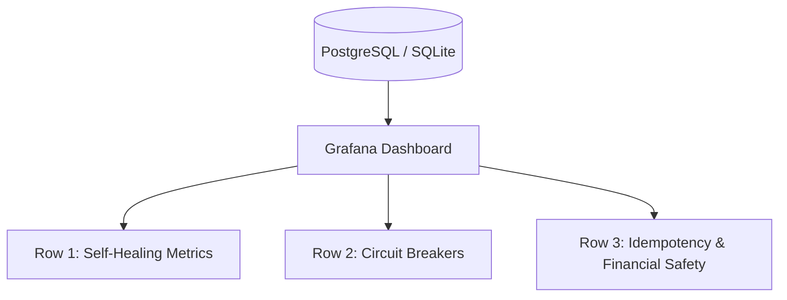

# TwisterLab Resilience & Health Monitoring Dashboard (v5.1.0)

This document provides the SQL queries and panel designs for the **Agent Health & Resilience** Grafana dashboard. It leverages the telemetry tables introduced in v5.1.0 (`capabilities_metrics`, `circuit_breakers`, `healing_logs`, and `live_orders`).

---

## 1. Dashboard Layout & Metrics Overview

The resilience dashboard is organized into three rows:
1. **System Immunitaire (Self-Healing MTTR & Success Rates)**
2. **Circuit Breakers & Quarantines (Hot Spots)**
3. **Idempotency & Cost-Saving Telemetry (Risk Control)**



---

## 2. Row 1: Self-Healing & Telemetry

### Panel 1.1: Global Self-Healing Success Rate (Gauge)
* **Goal**: Track the ratio of successful self-healing actions versus failures.
* **SQL Query**:
```sql
SELECT 
  SUM(CASE WHEN success = TRUE THEN 1 ELSE 0 END) * 100.0 / COUNT(*) AS value,
  'Success Rate (%)' AS metric
FROM healing_logs
WHERE created_at >= __timeFrom() AND created_at <= __timeTo();
```

### Panel 1.2: Healing MTTR & Actions by Category (Bar Gauge)
* **Goal**: Identify which category (`sql`, `cache`, `llm`, `network`) takes the most time or attempts to heal.
* **SQL Query**:
```sql
SELECT 
  category,
  COUNT(*) FILTER (WHERE success = TRUE) as resolved_count,
  COUNT(*) FILTER (WHERE success = FALSE) as unresolved_count,
  COUNT(*) as total_attempts
FROM healing_logs
WHERE created_at >= __timeFrom() AND created_at <= __timeTo()
GROUP BY category
ORDER BY total_attempts DESC;
```

---

## 3. Row 2: Circuit Breakers & Quarantines

### Panel 2.1: Currently Quarantined Capabilities (State Table)
* **Goal**: Show all capabilities that are currently blocked from execution due to repeated failures, with their respective backoff remaining.
* **SQL Query**:
```sql
SELECT 
  capability_name,
  quarantine_count,
  consecutive_failures,
  last_failure_at,
  quarantined_until,
  ROUND(EXTRACT(EPOCH FROM (quarantined_until - NOW()))) AS cooldown_remaining_seconds
FROM circuit_breakers
WHERE status = 'quarantined' AND quarantined_until > NOW()
ORDER BY quarantined_until ASC;
```

### Panel 2.2: Quarantine Counts Timeline (Heatmap / Time Series)
* **Goal**: Monitor historically unstable capabilities over time.
* **SQL Query**:
```sql
SELECT 
  $__timeGroupTrunc(last_failure_at, 1h) as time,
  capability_name,
  SUM(quarantine_count) as total_quarantines
FROM circuit_breakers
WHERE last_failure_at >= __timeFrom() AND last_failure_at <= __timeTo()
GROUP BY 1, 2
ORDER BY 1 ASC;
```

---

## 4. Row 3: Idempotency & Financial Protection

### Panel 3.1: Double-Buy / Double-Execution Prevented (Counter)
* **Goal**: Calculate the number of times the dual-layer idempotency guard (DB + clientOid) successfully blocked a duplicate trade or order submission.
* **SQL Query**:
```sql
-- Query counting records where the idempotency mechanism resolved a duplicate query
SELECT 
  COUNT(*) as prevented_duplicates_count
FROM execution_audit
WHERE action = 'create_market_order' 
  AND status = 'success' 
  AND response_data LIKE '%idempotency safety%'
  AND timestamp >= __timeFrom() AND timestamp <= __timeTo();
```

### Panel 3.2: Saved Capital / Exposure Safeguarded (Stat)
* **Goal**: Estimes the amount of money protected by preventing duplicate market entries (assuming a standard $5 micro-cap order size).
* **SQL Query**:
```sql
SELECT 
  COUNT(*) * 5.00 AS usd_saved
FROM execution_audit
WHERE action = 'create_market_order'
  AND response_data LIKE '%idempotency safety%'
  AND timestamp >= __timeFrom() AND timestamp <= __timeTo();
```

---

## 5. Grafana Alert Rules

1. **Auto-Healing Failure Storm Alert**:
   * **Condition**: If `healing_logs` records 5 failed outcomes in a 5-minute window.
   * **Query**: 
     ```sql
     SELECT COUNT(*) FROM healing_logs WHERE success = FALSE AND created_at >= NOW() - INTERVAL '5 minutes';
     ```
   * **Threshold**: `> 5`

2. **Critical Capability Quarantined Alert**:
   * **Condition**: Triggered immediately when a core capability (e.g. `request_live_execution` or `execute_query`) is quarantined.
   * **Query**:
     ```sql
     SELECT COUNT(*) FROM circuit_breakers WHERE capability_name IN ('request_live_execution', 'execute_query') AND status = 'quarantined' AND quarantined_until > NOW();
     ```
   * **Threshold**: `> 0`
